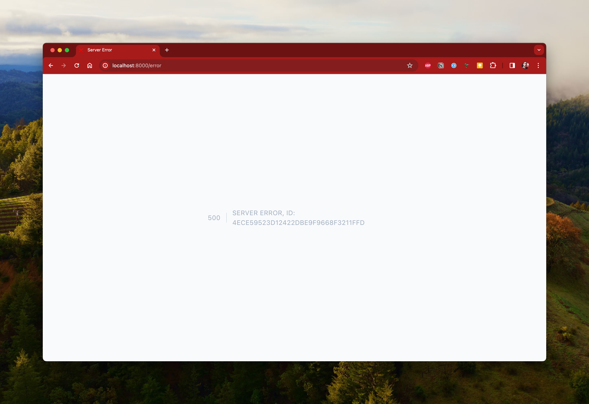

# Sentry with Event ID displayed on error page demo

# How it works

In Laravel, the report functionality reports the error and then hands it over to the renderer
functionality. The renderer can then display it in the error page (in Production) or an API response.



The idea is that an end user can provide the event ID to the developer who can then navigate to the
url https://peter-fox-personal.sentry.io/issues/?query=4ECE59523D12422DBE9F9668F3211FFD

Which then takes the user to the page in sentry for that specific event that occurred with in the
application and was reported to Sentry.


## Setting up the project

Clone and then copy the .env.example to .env
Then edit to supply your sentry DSN.

```dotenv
SENTRY_LARAVEL_DSN=
```
Then run the artisan server
```shell
php artisan serve
```
Then navigate to http://localhost:8000/error to see a unique event
id shown.
